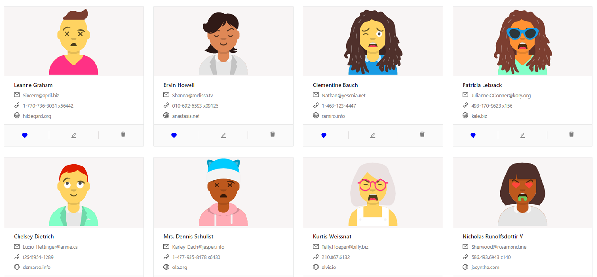
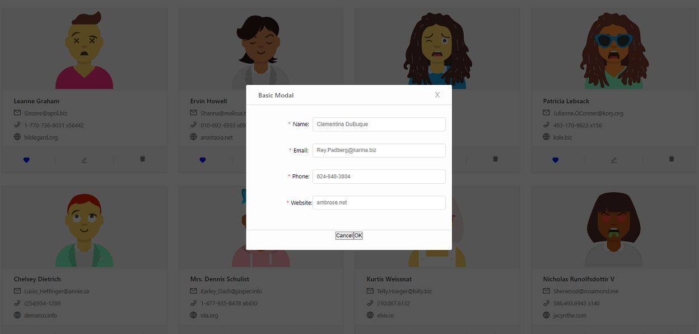

# User Cloud

User Cloud is an exercise project that I am constantly working on.
In this project, data is fetched from the server and displayed in the browser.
User can remove a person from the list by pressing the trash can icon and change the color of the heart icon of the selected person.   
The functionality that I'm currently workin on is the ability to edit user data in a modal window by pressing the pen icon.

## Technology
The technology I'm using in this project is React using React UI Ant Design library and DiceBear Avatars library

## Views

#### User view

#### Edit user view

